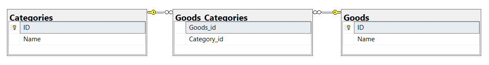

Если БД спроектирована так, как на диаграмме ниже:  

то SQL запрос выдаст желаемый результат по отображению всех пар «Имя продукта – Имя категории». Если у продукта нет категорий, то его имя все равно выводится.